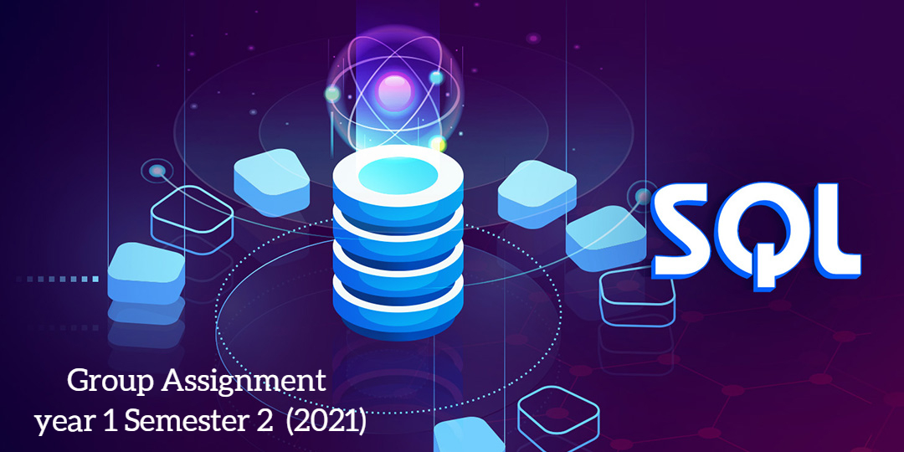

# ISDM-Project-Y1S2-2021

As the assignment of the Information Systems and Data Modeling module our group created a database using SQL. <b>The database is about a vehicle rental system</b> that is called AUTOWAG. We did the requirement analysis as functional, nonfunctional, and data requirements. Also, the <b>entity-relationship model</b> and <b>relational schema</b> are here. The <b>SQL code</b> of the database is included here.

This assignment was done in 2021 when we are in year 1 semester 2 of our university.

